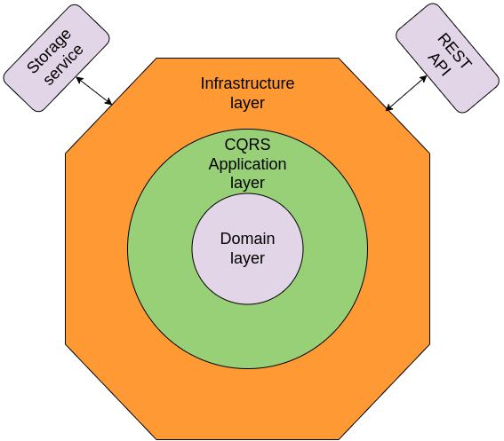

# Car sharing service MVP challenge

This a coding challenge to implement a minimal car-sharing service. In order to keep its complexity low, we're used a simple in-memory persistence layer.

## Problem to be solved

Design and implement a system to sharing cars between groups of people, for the company CrashedCar.

CrashedCar recently opened its new factory close to its headquarters. Communication
between teams is key and we often need to move from one place to another.
To achieve that, we have a fleet of cars ready to use for our employees.
As saving energy is one of our main goals, we propose sharing cars with multiple
groups of people. This is an opportunity to optimize the use of resources by introducing car
pooling.

You have been assigned to build the car availability service that will be used
to track the available seats in cars.

Cars have a different amount of seats available. They can accommodate groups of
up to 4, 5 or 6 people.

People request cars in groups of 1 to 6. People in the same group want to ride
in the same car. You can assign any group to any car that has enough empty seats
for them. If it's not possible to accommodate them, they're willing to wait until
there's a car available for them. Once a car is available for a group, they should immediately
enter and drive the car. You cannot ask them to change the car (i.e. swap them to make space for another group).
The trip order should be "First come, first serve".

For example, a group of 6 people is waiting for a car. They cannot enter a car with less than 6 available seats
(you can not split the group), so they need to wait. This means that smaller groups after them could enter a car with
fewer available seats before them.

## API

To simplify the challenge and remove language restrictions, this service must
provide a REST API that will be used to interact with it.

This API must comply with the following contract:

### GET /status

Indicate the service has started up correctly and is ready to accept requests.

Responses:

* **200 OK** When the service is ready to receive requests.

### PUT /v1/cars

Load the list of available cars in the service and remove all previous data
(existing journeys and cars). This method may be called more than once during
the life cycle of the service.

**Body** _required_ The list of cars to load.

**Content Type** `application/json`

Sample:

```json
[
  {
    "id": "195cc257-a278-4b83-8344-188bee0b49cf",
    "seats": 4
  },
  {
    "id": "f513bb90-4c2e-46fb-8392-63000d9d8b0a",
    "seats": 6
  }
]
```

Responses:

* **200 OK** When the list is registered correctly.
* **400 Bad Request** When there is a failure in the request format, expected
  headers, or the payload can't be unmarshalled.

### POST /v1/journey

A group of people requests to perform a journey.

**Body** _required_ The group of people that wants to perform the journey

**Content Type** `application/json`

Sample:

```json
{
  "id": "e3e4a619-8fd1-491a-9642-0a6665035d69",
  "people": 4
}
```

Responses:

* **200 OK** or **202 Accepted** When the group is registered correctly.
* **400 Bad Request** When there is a failure in the request format or the
  payload can't be unmarshalled.

### POST /v1/journey/dropoff

A group of people requests to be dropped off. Whether they traveled or not.

**Body** _required_ A form with the group ID, such that `ID=e3e4a619-8fd1-491a-9642-0a6665035d69`

**Content Type** `application/x-www-form-urlencoded`

Responses:

* **200 OK** or **204 No Content** When the group is unregistered correctly.
* **404 Not Found** When the group is not to be found.
* **400 Bad Request** When there is a failure in the request format or the payload can't be unmarshalled.

### POST /v1/journey/locate

Given a group ID such that `ID=X`, return the car the group is traveling
with, or no car if they are still waiting to be served.

**Body** _required_ A url encoded form with the group ID such that `ID=e3e4a619-8fd1-491a-9642-0a6665035d69`

**Content Type** `application/x-www-form-urlencoded`

**Accept** `application/json`

Responses:

* **200 OK** With the car as the payload when the group is assigned to a car.
* **204 No Content** When the group is waiting to be assigned to a car.
* **404 Not Found** When the group is not to be found.
* **400 Bad Request** When there is a failure in the request format or the payload can't be unmarshalled.

### Applied approach

It's important to me to decouple the domain from infra layers and test them separately. So I've applied Hexagonal architecture, which means there is a kind of onion architecture. I've also used CQRS by splitting queries from commands. 

Applying HA along with DDD, CQRS and Even-Driven could be too much at first look. But using them give these advantages:

* Hexagonal architecture allows me to focus in each layer and test them separately.
* I put the domain in the center by applying the DDD approach. All logic related to the problem solution is there, and all are tested.
* Applying CQRS by separating commands and queries could be unnecessary, given that, in this case, there are no domain events that the commands would propagate. Buts using this pattern helps to consider each use case to be implemented.



### DDD layer

I've identified two entities and a domain service:

* Car: Entity
* Group: Entity
* Fleet: Domain service in charge of applying all business rules that link implies cars and Group

All business rules, as well as the domain invariants, are implemented in this layer. 

The DDD layer is self-contained and **tested** separately. By doing so, we are sure that the business domain works appropriately.

### DropOff - Journey strategy

The cars and Groups are, in the domain, in an ordered slice. So, when a group is dropped off, the first waiting group is tried to be added. And so on.

### CQRS - Application services layer

Here there is an application service for each use case. The application service implements a  *command* or *query* handler. It's in charge of loading the domain state from the storage layer and requesting it for the action of the use case. Once it finishes,  the application service persists in the new domain state in the case of a command.

### Infra layer

Here is where the service communicates with the outside world. There are two infra ports:

* REST API - the list of HTTP handlers that compounds the REST API
* Storage service - Where the domain state is persisted. Given that there is no restriction related to that in the challenge, I've tried straightforward storage in memory. IMO, I add more value to the challenge, using my time in implementing HA architecture than adding more complexity with SQL DDD, or worse, by adding an ORM. BTW, the access to the storage layer uses *repository pattern* 

### Design

I've applied SOLID principles, keep-it-simple, and clean practices. I hope you'll appreciate it.

* SRP - Each method of the domain has only one responsibility
* OCP - The domain can be extended without affecting the current functionality
* ISP - All interface methods are used
* DIP - Achieved by injecting the implementation of interfaces from the outer layers to the inner ones.
* LSP - Not sure about how to apply this principle in Go, given that it uses composition instead of inheritance :-)

### Next iterations

For the next iterations, I'd take a look to:

* Inject the Fleet domain service as *DI*, so it will make the app layer test simpler.

* Current implementation is not transactional. Adding transactional storage could also be the next step.

* Adding o11y (observability) integration, with a Prometheus, por example

* Adding persistent storage. A no SQL storage like Redis fits enough if the domain is not more complex. Otherwise, it could be worth adding SQL storage.

## Repo layout

* accpetance_test - the acceptance test
* assets - images of this document
* scripts - an script to compile the Docker container locally, for development purposes
* cmd - where the *main.go* is
* internal - used to [reduce the public API surface](https://dave.cheney.net/2019/10/06/use-internal-packages-to-reduce-your-public-api-surface)
* internal/app - CQRS layer, application services
* internal/domain - where the domain entities and business rules lives
* internal/fixtures builders - needed fixtures for the tests
* internal/helpers - misc helpers used to improved the code reading
* internal/infra - infrastructure layer
* internal/infra/repository - storage service. Implements *repository* pattern
* internal/infra/api - set of HTTP handlers that compounds the REST API of the service

There are also other files used for development purposes:

  * internal/golangci.yml - used as linter
  * internal/revive.toml - used as linter
  * Makefile

## How to run it locally

There is a Make file in the root for that. Only do:

```sh
  make docker-build
  make docker-run
  make docker-logs
```

These commands will build the Docker image, start it listening in the port 80, and logs the HTTP interactions.

## Acceptance test
There is an acceptance test. To execute it do:

```sh
  make test-acceptance
```

## Tooling and libs used

To implement the solution I've used:

* Go libs:
  * github.com/go-chi/chi v1.5.4
  * github.com/rs/cors v1.8.2
  * github.com/stretchr/testify v1.8.1
* Tooling:
  * Linux Manjaro as development platform
  * Go 1.19.1
  * Docker 20.10.2
  * GNU Make 4.3

### Dockerfile strategy

I've opted for optimizing the Docker image size. So only the binary is added in the resulting image.
